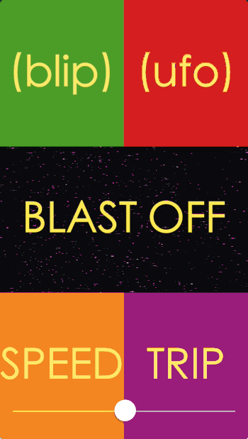

# MartianMonster

Disney's "Thrilling, Chilling Sounds of the Haunted House" was ressurected when the band Phish produced an entirely original set of music to accompany it on Halloween 2014. The final act of the performance, "Martian Monster", makes use of these classic soundbites which have become an instant hit with fans.

Here is an iOS app that allows the user to have some fun with those very same soundbites, including the ability to manipulate the pitch as desired.

You can listen to "Martian Monster" here: https://www.youtube.com/watch?v=bA7hJEYhzDY
